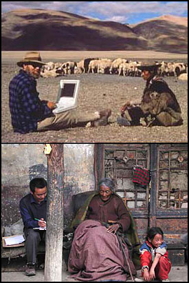

# About this Collection

The Tibetan Oral History and Archive Project (TOHAP) is a digital online web archive of oral history interviews in Tibetan and Chinese with accompanying written transcripts (in English) that documents the social and political history of modern Tibet. The interview tapes can be listened to simultaneous with reading the transcripts. The translations were made in a literal style to retain a flavor of the original Tibetan. The TOHAP collection includes a large corpus of interviews from common folks and Drepung monastery monks speaking about their lives, and Tibetan and Chinese officials speaking about modern Tibetan history. An interactive [glossary](./GLOSSARY.md) is available to explain Tibetan terms that appear in the transcripts.

As of April 2019, the portion of the TOHAP Collection that is available on line consists of 403 tapes (361 from the Political/History collection, 35 from the common folk collection and 7 from the Drepung collection). These come from interviews with 125 interviewees. This comprises on line approximately 500 hours of recordings and about 11,000 pages of transcripts. Future installments will add the small remainder of the Political collection and more tapes and transcripts from the Common Folk and Drepung Collections over the next few years.

These interviews were collected by Professor Melvyn C. Goldstein and his assistants/colleagues during a series of research projects on modern Tibet history and society that were funded by the National Geographic Society (1980-81), National Endowment for the Humanities (RO-20261-82, RO-20886-85, RO-21860-89, RO-22251-91, RO-22754-94) and during a large Tibetan Oral History Project funded by the Henry Luce Foundation and the National Endowment for the Humanities (RZ-20585-00, RZ-50326-05, RZ-50845-08). Professor Goldstein is the John Reynolds Harkness Professor of Anthropology and Co-Director of the Center for Research on Tibet at Case Western Reserve University, Cleveland, Ohio. He is a member of the National Academy of Sciences.

  
*A collage of images showing Professor Goldstein and his students conducting interviews in Tibet.*

Knowledge of the social and political history of Tibet during the second half of the Twentieth Century has been limited by the absence of the voices of everyday Tibetans and officials from the traditional Tibetan government. The Tibetan Oral History and Archive Project was undertaken by Professor Goldstein to collect and preserve these voices and with it a record of the diversity of life as it was lived in Tibet in the traditional and socialist eras.

The ensuing Oral History Archive consists of interviews with almost 700 Tibetans (and a few Chinese) living in the Tibet Autonomous Region of China and in exile in India and the West about their lives and modern history. This archive, the largest of its type in the world, contains three collections: the Common Folk Oral History collection, the Political or Historical Collection and the Drepung Monastery Collection. 

The Common Folk Collection consists of recorded interviews in Tibet and India with over 600 Tibetans from all strata about their lives during the traditional society and the socialist period through the Cultural Revolution. Its files begin with the code: OR…

The Political Collection consists of recorded interviews with former Tibetan government officials who played important roles in Tibet's history. The topics discussed include historical events in both the traditional and socialist periods. Its files begin with the code: H…

The Drepung Monastery Collection consists of recorded interviews on monastic social and economic life with roughly 100 monks who were members of Drepung monastery in the traditional era. Drepung monastery is located 5 miles outside of Lhasa and was Tibet's largest monastery, housing about 10,000 monks in 1959 at the end of the traditional era. Its files begin with the code:  M…
